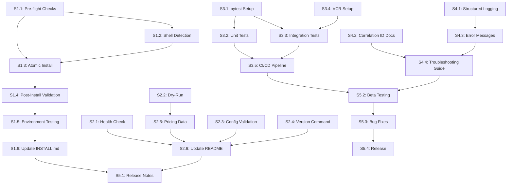

# Implementation Workflow: git-ai-summary v1.1

## Document Information

**Version**: 1.0
**Created**: 2025-10-22
**Based On**: PRD.md, REQUIREMENTS.md, Expert Panel Review
**Target Release**: v1.1.0 (Q1 2025)
**Workflow Strategy**: Systematic with Agile execution

---

## Table of Contents

1. [Overview](#overview)
2. [Workflow Execution Plan](#workflow-execution-plan)
3. [Sprint 1: Foundation & Installation](#sprint-1-foundation--installation)
4. [Sprint 2: Observability & Validation](#sprint-2-observability--validation)
5. [Sprint 3: Testing Infrastructure](#sprint-3-testing-infrastructure)
6. [Sprint 4: Structured Logging & Refinement](#sprint-4-structured-logging--refinement)
7. [Sprint 5: Polish & Release](#sprint-5-polish--release)
8. [Dependency Graph](#dependency-graph)
9. [Quality Gates](#quality-gates)
10. [Risk Mitigation](#risk-mitigation)

---

## Overview

### Objectives

Transform git-ai-summary from functional prototype (v1.0) to production-ready tool (v1.1) through:
- **Robust Installation**: 95%+ success rate with pre-flight validation
- **Operational Visibility**: Health checks, dry-run mode, cost estimation
- **Test Coverage**: 60%+ with comprehensive unit/integration tests
- **Production Observability**: Structured logging and error handling

### Success Criteria

| Metric | Current (v1.0) | Target (v1.1) | Measurement |
|--------|----------------|---------------|-------------|
| Installation Success Rate | ~70% | 95%+ | Beta testing (N=50) |
| Test Coverage | 0% | 60%+ | pytest-cov |
| Mean Time to First Success | ~20 min | <5 min | User testing |
| Support Tickets (Installation) | ~15/month | <3/month | GitHub issues |

### Timeline

**Total Duration**: 10 weeks (5 sprints × 2 weeks)
**Start Date**: Week 1 of Q1 2025
**Target Release**: Week 10 (end of Q1 2025)

---

## Workflow Execution Plan

### Execution Strategy

**Approach**: Systematic with Agile ceremonies
- Daily: Standup (async via chat for solo dev)
- Weekly: Sprint review and planning
- Bi-weekly: Stakeholder demo (optional)

**Parallel Work Streams**:
- Stream A: Core functionality (installation, commands)
- Stream B: Testing infrastructure (can run in parallel)
- Stream C: Documentation (ongoing throughout)

### Personas & Responsibilities

| Persona | Responsibilities | Sprints |
|---------|------------------|---------|
| **DevOps Engineer** | Installation, shell detection, rollback | S1, S5 |
| **Backend Engineer** | Health check, dry-run, config validation | S2 |
| **QA Engineer** | Testing infrastructure, coverage, CI/CD | S3, S4 |
| **Technical Writer** | Documentation updates, release notes | S1-S5 |
| **Product Owner** | Requirements validation, beta testing | S4, S5 |

---

## Sprint 1: Foundation & Installation

**Duration**: Weeks 1-2
**Goal**: Bulletproof installation experience
**Owner**: DevOps Engineer

### Tasks Overview

| Task ID | Description | Effort | Dependencies | Priority |
|---------|-------------|--------|--------------|----------|
| S1.1 | Implement pre-flight checks | 5 SP | None | P0 |
| S1.2 | Add shell auto-detection | 3 SP | S1.1 | P0 |
| S1.3 | Implement atomic installation with rollback | 8 SP | S1.1, S1.2 | P0 |
| S1.4 | Add post-install validation | 3 SP | S1.3 | P0 |
| S1.5 | Test on clean environments | 5 SP | S1.4 | P0 |
| S1.6 | Update INSTALL.md documentation | 2 SP | S1.5 | P1 |

**Total Effort**: 26 story points (~10 days for solo dev)

---

### Task S1.1: Implement Pre-flight Checks

**Objective**: Validate system requirements before installation

**Acceptance Criteria**:
- ✅ Verify Python 3.8+ installed
- ✅ Verify git is available
- ✅ Check disk space (>100MB for venv)
- ✅ Validate write permissions to ~/bin and ~/.config
- ✅ Clear error messages if any check fails

**Implementation**:

```bash
# install.sh - Add pre-flight checks at beginning

#!/bin/bash
set -euo pipefail

echo "=== Pre-flight Checks ==="

# Check Python version
check_python() {
    if ! command -v python3 &> /dev/null; then
        echo "❌ Python 3 not found. Please install Python 3.8 or higher."
        echo "   Install: https://www.python.org/downloads/"
        exit 1
    fi

    python_version=$(python3 --version | cut -d' ' -f2)
    required_version="3.8"

    if ! printf '%s\n' "$required_version" "$python_version" | sort -V -C; then
        echo "❌ Python $python_version found, but 3.8+ required"
        exit 1
    fi

    echo "✓ Python $python_version"
}

# Check git
check_git() {
    if ! command -v git &> /dev/null; then
        echo "❌ Git not found. Please install git."
        echo "   Install: https://git-scm.com/downloads"
        exit 1
    fi

    git_version=$(git --version | cut -d' ' -f3)
    echo "✓ Git $git_version"
}

# Check disk space
check_disk_space() {
    required_mb=100
    install_dir="$(cd "$(dirname "${BASH_SOURCE[0]}")" && pwd)"
    available_mb=$(df -m "$install_dir" | awk 'NR==2 {print $4}')

    if [ "$available_mb" -lt "$required_mb" ]; then
        echo "❌ Insufficient disk space: ${available_mb}MB available, ${required_mb}MB required"
        exit 1
    fi

    echo "✓ Disk space: ${available_mb}MB available"
}

# Check write permissions
check_permissions() {
    bin_dir="$HOME/bin"
    config_dir="$HOME/.config"

    # Test write to ~/bin
    if ! mkdir -p "$bin_dir" 2>/dev/null; then
        echo "❌ Cannot create $bin_dir (permission denied)"
        exit 1
    fi
    echo "✓ Write access to $bin_dir"

    # Test write to ~/.config
    if ! mkdir -p "$config_dir" 2>/dev/null; then
        echo "❌ Cannot create $config_dir (permission denied)"
        exit 1
    fi
    echo "✓ Write access to $config_dir"
}

# Run all checks
check_python
check_git
check_disk_space
check_permissions

echo ""
echo "All pre-flight checks passed!"
echo ""
```

**Testing**:
```bash
# Test on fresh Ubuntu Docker container
docker run -it ubuntu:22.04 bash
# Copy install.sh and test without Python installed
# Expected: Clear error about missing Python

# Test with Python 2.7 only
# Expected: Clear error about version requirement

# Test with insufficient disk space (small container)
# Expected: Clear error about disk space
```

**Files Changed**:
- `install.sh` (add pre-flight checks at beginning)

**Quality Gate**: All checks must pass or fail clearly with actionable guidance

---

### Task S1.2: Add Shell Auto-Detection

**Objective**: Automatically detect user's shell and update correct config file

**Acceptance Criteria**:
- ✅ Detect bash, zsh, fish from $SHELL environment variable
- ✅ Add PATH to appropriate config file (~/.bashrc, ~/.zshrc, ~/.config/fish/config.fish)
- ✅ Verify PATH modification worked (in-script test)
- ✅ Handle edge cases (no $SHELL, unknown shell)

**Implementation**:

```bash
# install.sh - Shell auto-detection function

detect_shell_config() {
    local shell_name=""
    local config_file=""

    # Detect from $SHELL
    if [ -n "${SHELL:-}" ]; then
        shell_name=$(basename "$SHELL")
    else
        # Fallback: detect from current process
        shell_name=$(ps -p $$ -o comm=)
    fi

    case "$shell_name" in
        bash)
            # Prefer .bashrc, fallback to .bash_profile, then .profile
            if [ -f "$HOME/.bashrc" ]; then
                config_file="$HOME/.bashrc"
            elif [ -f "$HOME/.bash_profile" ]; then
                config_file="$HOME/.bash_profile"
            else
                config_file="$HOME/.profile"
            fi
            ;;
        zsh)
            config_file="$HOME/.zshrc"
            ;;
        fish)
            mkdir -p "$HOME/.config/fish"
            config_file="$HOME/.config/fish/config.fish"
            ;;
        *)
            # Unknown shell, use generic .profile
            echo "⚠ Unknown shell: $shell_name, using ~/.profile"
            config_file="$HOME/.profile"
            ;;
    esac

    echo "$config_file"
}

# Add PATH to detected shell config
add_to_path() {
    local config_file=$(detect_shell_config)
    local bin_dir="$HOME/bin"
    local path_entry="export PATH=\"\$HOME/bin:\$PATH\""

    echo "Detected shell config: $config_file"

    # Check if already in PATH
    if grep -q "HOME/bin" "$config_file" 2>/dev/null; then
        echo "✓ $bin_dir already in PATH ($config_file)"
        return 0
    fi

    # Add to config file
    echo "" >> "$config_file"
    echo "# Added by git-ai-summary installer" >> "$config_file"
    echo "$path_entry" >> "$config_file"

    echo "✓ Added $bin_dir to PATH in $config_file"
    echo ""
    echo "⚠ Run this command to activate:"
    echo "  source $config_file"
}
```

**Testing**:
```bash
# Test with bash
export SHELL=/bin/bash
./install.sh
grep "HOME/bin" ~/.bashrc  # Should find PATH entry

# Test with zsh
export SHELL=/bin/zsh
./install.sh
grep "HOME/bin" ~/.zshrc  # Should find PATH entry

# Test with fish
export SHELL=/usr/bin/fish
./install.sh
grep "HOME/bin" ~/.config/fish/config.fish  # Should find PATH entry

# Test with unknown shell
export SHELL=/bin/tcsh
./install.sh
grep "HOME/bin" ~/.profile  # Should fallback to .profile
```

**Files Changed**:
- `install.sh` (replace hardcoded ~/.bashrc with shell detection)

**Quality Gate**: Works correctly on bash, zsh, fish (3 most common shells)

---

### Task S1.3: Implement Atomic Installation with Rollback

**Objective**: Install in temporary staging area, validate, then finalize (or rollback on failure)

**Acceptance Criteria**:
- ✅ Stage installation in /tmp/git-ai-summary-install-$$
- ✅ Validate venv creation succeeds
- ✅ Validate dependencies install successfully
- ✅ Only finalize if all steps succeed
- ✅ Rollback and cleanup on any failure
- ✅ Log all steps for troubleshooting

**Implementation**:

```bash
# install.sh - Atomic installation with rollback

set -euo pipefail

# Trap to cleanup on error
INSTALL_LOG="/tmp/git-ai-summary-install-$$.log"
STAGING_DIR="/tmp/git-ai-summary-staging-$$"

cleanup_on_error() {
    echo ""
    echo "❌ Installation failed!"
    echo "Cleaning up staging directory..."
    rm -rf "$STAGING_DIR"
    echo ""
    echo "Installation log saved to: $INSTALL_LOG"
    echo "Please report this issue with the log file."
    exit 1
}

trap cleanup_on_error ERR

# Log function
log() {
    echo "$1" | tee -a "$INSTALL_LOG"
}

# Main installation
main() {
    log "=== Git AI Summary Installation ==="
    log "Timestamp: $(date)"
    log "User: $(whoami)"
    log "PWD: $(pwd)"
    log ""

    # Pre-flight checks (from S1.1)
    log "Running pre-flight checks..."
    check_python
    check_git
    check_disk_space
    check_permissions

    # Stage 1: Create staging directory
    log ""
    log "=== Stage 1: Staging Directory ==="
    mkdir -p "$STAGING_DIR"
    log "✓ Created: $STAGING_DIR"

    # Stage 2: Create virtual environment
    log ""
    log "=== Stage 2: Virtual Environment ==="
    python3 -m venv "$STAGING_DIR/venv" >> "$INSTALL_LOG" 2>&1
    log "✓ Created venv"

    # Stage 3: Install dependencies
    log ""
    log "=== Stage 3: Dependencies ==="
    "$STAGING_DIR/venv/bin/pip" install --upgrade pip >> "$INSTALL_LOG" 2>&1
    "$STAGING_DIR/venv/bin/pip" install -r requirements.txt >> "$INSTALL_LOG" 2>&1
    log "✓ Installed dependencies"

    # Stage 4: Validate installation
    log ""
    log "=== Stage 4: Validation ==="
    if ! "$STAGING_DIR/venv/bin/python" git-ai-summary.py --help >> "$INSTALL_LOG" 2>&1; then
        log "❌ Validation failed: script cannot run"
        cleanup_on_error
    fi
    log "✓ Validation passed"

    # Stage 5: Finalize (move to final location)
    log ""
    log "=== Stage 5: Finalization ==="
    INSTALL_DIR="$(cd "$(dirname "${BASH_SOURCE[0]}")" && pwd)"

    # Remove old venv if exists
    if [ -d "$INSTALL_DIR/venv" ]; then
        log "Removing old venv..."
        rm -rf "$INSTALL_DIR/venv"
    fi

    # Move staged venv to final location
    mv "$STAGING_DIR/venv" "$INSTALL_DIR/venv"
    log "✓ Moved venv to $INSTALL_DIR"

    # Create symlink (from S1.4)
    create_symlink

    # Add to PATH (from S1.2)
    add_to_path

    # Cleanup staging directory
    rm -rf "$STAGING_DIR"
    log "✓ Cleaned up staging directory"

    log ""
    log "=== Installation Complete! ==="
    log "Installation log: $INSTALL_LOG"
}

main
```

**Testing**:
```bash
# Test successful installation
./install.sh
# Expected: Success, venv created, symlink works

# Test failure scenarios:
# 1. Corrupt requirements.txt
echo "invalid-package==999.999" >> requirements.txt
./install.sh
# Expected: Rollback, staging dir cleaned up, error logged

# 2. Kill process mid-installation
./install.sh &
PID=$!
sleep 2
kill -9 $PID
# Expected: Staging dir remains (manual cleanup needed)
# Note: Add trap for SIGTERM/SIGINT to cleanup
```

**Files Changed**:
- `install.sh` (major refactor with staging/rollback logic)

**Quality Gate**: Installation either fully succeeds or fully rolls back (no partial state)

---

### Task S1.4: Add Post-Install Validation

**Objective**: Automatically verify installation succeeded

**Acceptance Criteria**:
- ✅ Test symlink works from different directory
- ✅ Verify venv activation and Python execution
- ✅ Run `--help` flag as smoke test
- ✅ Confirm configuration file is readable/writable

**Implementation**:

```bash
# install.sh - Post-install validation

post_install_validation() {
    log ""
    log "=== Post-Install Validation ==="

    local bin_dir="$HOME/bin"
    local symlink="$bin_dir/git-ai-summary"
    local config_dir="$HOME/.config/git-ai-summary"

    # Test 1: Symlink exists and is valid
    if [ ! -L "$symlink" ]; then
        log "❌ Symlink not created: $symlink"
        return 1
    fi
    log "✓ Symlink created: $symlink"

    # Test 2: Symlink works from different directory
    cd /tmp
    if ! "$symlink" --help > /dev/null 2>&1; then
        log "❌ Symlink does not work from /tmp"
        return 1
    fi
    log "✓ Symlink works from different directory"

    # Test 3: Config directory exists
    if [ ! -d "$config_dir" ]; then
        log "❌ Config directory not created: $config_dir"
        return 1
    fi
    log "✓ Config directory created: $config_dir"

    # Test 4: Config file is writable
    if [ ! -w "$config_dir/.env" ]; then
        log "⚠ Config file not writable: $config_dir/.env"
    else
        log "✓ Config file writable"
    fi

    log ""
    log "All post-install validation checks passed!"
    return 0
}

# Call at end of main()
main() {
    # ... existing installation steps ...

    # Post-install validation
    if ! post_install_validation; then
        log ""
        log "⚠ Installation completed but validation failed"
        log "Please check the installation log: $INSTALL_LOG"
        exit 1
    fi
}
```

**Testing**:
```bash
# Test successful validation
./install.sh
# Expected: All validation checks pass

# Test symlink failure
rm ~/bin/git-ai-summary
./install.sh
# Expected: Validation fails with clear error

# Test config permission failure
chmod 000 ~/.config/git-ai-summary/.env
./install.sh
# Expected: Warning about non-writable config
```

**Files Changed**:
- `install.sh` (add post_install_validation function)

**Quality Gate**: Validation catches common installation issues automatically

---

### Task S1.5: Test on Clean Environments

**Objective**: Verify installation works on fresh systems

**Acceptance Criteria**:
- ✅ Test on Ubuntu 22.04 (bash)
- ✅ Test on Ubuntu 22.04 (zsh)
- ✅ Test on macOS (zsh)
- ✅ Test on WSL2 Ubuntu (bash)
- ✅ Document any platform-specific issues

**Implementation**:

```dockerfile
# test/Dockerfile.ubuntu-bash
FROM ubuntu:22.04

RUN apt-get update && apt-get install -y \
    python3 python3-pip python3-venv git curl

# Create test user
RUN useradd -m -s /bin/bash testuser
USER testuser
WORKDIR /home/testuser

# Copy installation files
COPY --chown=testuser:testuser . /home/testuser/git-ai-summary

# Run installation
RUN cd git-ai-summary && ./install.sh

# Verify
RUN git-ai-summary --help

---

# test/Dockerfile.ubuntu-zsh
FROM ubuntu:22.04

RUN apt-get update && apt-get install -y \
    python3 python3-pip python3-venv git curl zsh

# Create test user with zsh
RUN useradd -m -s /bin/zsh testuser
USER testuser
WORKDIR /home/testuser

# Copy installation files
COPY --chown=testuser:testuser . /home/testuser/git-ai-summary

# Run installation
RUN cd git-ai-summary && ./install.sh

# Verify
RUN /bin/zsh -c "source ~/.zshrc && git-ai-summary --help"
```

**Testing Script**:
```bash
# test/run_install_tests.sh
#!/bin/bash

echo "=== Testing Installation on Multiple Platforms ==="

# Test 1: Ubuntu with bash
echo ""
echo "Test 1: Ubuntu 22.04 (bash)"
docker build -f test/Dockerfile.ubuntu-bash -t git-ai-summary-test-bash .
if [ $? -eq 0 ]; then
    echo "✓ Ubuntu bash installation succeeded"
else
    echo "❌ Ubuntu bash installation failed"
    exit 1
fi

# Test 2: Ubuntu with zsh
echo ""
echo "Test 2: Ubuntu 22.04 (zsh)"
docker build -f test/Dockerfile.ubuntu-zsh -t git-ai-summary-test-zsh .
if [ $? -eq 0 ]; then
    echo "✓ Ubuntu zsh installation succeeded"
else
    echo "❌ Ubuntu zsh installation failed"
    exit 1
fi

# Test 3: macOS (manual test, document procedure)
echo ""
echo "Test 3: macOS (manual test required)"
echo "Procedure documented in test/MACOS_TEST.md"

# Test 4: WSL2 (manual test, document procedure)
echo ""
echo "Test 4: WSL2 Ubuntu (manual test required)"
echo "Procedure documented in test/WSL2_TEST.md"

echo ""
echo "=== All automated tests passed! ==="
echo "Run manual tests for macOS and WSL2."
```

**Files Changed**:
- `test/Dockerfile.ubuntu-bash` (new)
- `test/Dockerfile.ubuntu-zsh` (new)
- `test/run_install_tests.sh` (new)
- `test/MACOS_TEST.md` (new, manual test procedure)
- `test/WSL2_TEST.md` (new, manual test procedure)

**Quality Gate**: Installation succeeds on all 4 test environments

---

### Task S1.6: Update INSTALL.md Documentation

**Objective**: Document improved installation process

**Acceptance Criteria**:
- ✅ Update INSTALL.md with new pre-flight checks
- ✅ Document automatic shell detection
- ✅ Add troubleshooting section for common errors
- ✅ Include rollback procedure for failed installations
- ✅ Add section on verification steps

**Implementation**:

Update `INSTALL.md` with:
1. New "Pre-flight Checks" section explaining automatic validation
2. "Shell Auto-Detection" section showing supported shells
3. "Troubleshooting" section with common errors and fixes
4. "Rollback" section explaining how to recover from failed install
5. "Verification" section showing post-install checks

**Files Changed**:
- `INSTALL.md` (update with new features and troubleshooting)

**Quality Gate**: Documentation is clear, accurate, and tested by someone unfamiliar with the project

---

## Sprint 2: Observability & Validation

**Duration**: Weeks 3-4
**Goal**: Enable confident usage through visibility
**Owner**: Backend Engineer

### Tasks Overview

| Task ID | Description | Effort | Dependencies | Priority |
|---------|-------------|--------|--------------|----------|
| S2.1 | Implement --health-check command | 5 SP | None | P0 |
| S2.2 | Implement --dry-run mode with cost estimation | 8 SP | None | P0 |
| S2.3 | Implement --validate-config command | 3 SP | None | P1 |
| S2.4 | Implement --version command | 1 SP | None | P2 |
| S2.5 | Create provider pricing data module | 3 SP | S2.2 | P1 |
| S2.6 | Update README with new commands | 2 SP | S2.1-S2.4 | P1 |

**Total Effort**: 22 story points (~8-9 days)

---

### Task S2.1: Implement --health-check Command

**Objective**: Validate configuration and connectivity without making API calls

**Acceptance Criteria**: See FR-004 in REQUIREMENTS.md

**Implementation**:

```python
# git-ai-summary.py

def health_check(config: Config) -> int:
    """Run health check and return exit code (0=healthy, 1=unhealthy)."""
    logger = logging.getLogger(__name__)
    healthy = True

    print("=== Git AI Summary - Health Check ===")
    print("")

    # Check 1: Configuration loaded
    if config.config_file:
        print(f"✓ Configuration loaded from: {config.config_file}")
    else:
        print("✓ Configuration loaded from environment variables")

    # Check 2: Provider and model
    print(f"✓ Provider: {config.provider}")

    model = get_model_for_provider(config)
    print(f"✓ Model: {model}")

    # Check 3: API Key
    api_key = get_api_key_for_provider(config)
    if api_key:
        # Mask API key (show first 7 and last 4 chars)
        masked_key = f"{api_key[:7]}***...{api_key[-4:]}"
        print(f"✓ API Key: present ({masked_key})")
    else:
        print(f"✗ API Key: missing")
        print(f"  Set {get_api_key_env_name(config.provider)} in .env file")
        healthy = False

    # Check 4: Connectivity (simple HTTP GET to base URL)
    if config.provider != "ollama":  # Skip connectivity for local provider
        try:
            base_url = get_base_url_for_provider(config)
            print(f"✓ Connectivity: testing {base_url}...")

            start_time = time.time()
            # Simple HEAD request to check connectivity
            response = requests.head(base_url, timeout=5)
            duration_ms = int((time.time() - start_time) * 1000)

            if response.status_code < 500:
                print(f"✓ Connectivity: SUCCESS ({duration_ms}ms)")
            else:
                print(f"✗ Connectivity: FAILED (HTTP {response.status_code})")
                healthy = False
        except requests.exceptions.Timeout:
            print(f"✗ Connectivity: TIMEOUT (>5s)")
            print(f"  Check network connection or firewall settings")
            healthy = False
        except requests.exceptions.ConnectionError as e:
            print(f"✗ Connectivity: FAILED ({str(e)})")
            print(f"  Provider may be unreachable")
            healthy = False

    # Check 5: Model availability (provider-specific, optional)
    # TODO: Add provider-specific model validation

    # Summary
    print("")
    if healthy:
        print("System Status: HEALTHY ✓")
        return 0
    else:
        print("System Status: UNHEALTHY ✗")
        print("")
        print("Troubleshooting:")
        print("- Check API key in .env file")
        print("- Verify network connectivity")
        print(f"- See documentation: {README_URL}#troubleshooting")
        return 1

# Add to main()
parser.add_argument('--health-check', action='store_true',
    help='Verify configuration and connectivity')

if args.health_check:
    config = load_config(provider=args.provider, model=args.model)
    sys.exit(health_check(config))
```

**Testing**:
```bash
# Test with valid config
./git-ai-summary.py --health-check
# Expected: All checks pass, exit 0

# Test with missing API key
unset ANTHROPIC_API_KEY
./git-ai-summary.py --provider anthropic --health-check
# Expected: API key check fails, exit 1

# Test with unreachable provider (disconnect network)
./git-ai-summary.py --provider anthropic --health-check
# Expected: Connectivity check fails, exit 1
```

**Files Changed**:
- `git-ai-summary.py` (add health_check function and CLI arg)

**Quality Gate**: Health check correctly identifies common configuration issues

---

### Task S2.2: Implement --dry-run Mode with Cost Estimation

**Objective**: Show what would be analyzed and estimated cost without making API calls

**Acceptance Criteria**: See FR-005 in REQUIREMENTS.md

**Implementation**:

```python
# git-ai-summary.py

# Provider pricing data (cost per 1M input tokens in USD)
PROVIDER_PRICING = {
    "openai": {
        "gpt-4o": 2.50,
        "gpt-4o-mini": 0.15,
        "gpt-4-turbo": 10.00,
    },
    "anthropic": {
        "claude-3-5-sonnet-latest": 3.00,
        "claude-3-5-sonnet-20241022": 3.00,
        "claude-3-5-haiku-latest": 0.80,
        "claude-3-opus-latest": 15.00,
    },
    "gemini": {
        "gemini-1.5-pro": 1.25,
        "gemini-1.5-flash": 0.075,
    },
    # ... other providers
    "ollama": 0.00,  # Local, no cost
}

def estimate_tokens(text: str) -> int:
    """Estimate token count from text (conservative estimate)."""
    # Simple heuristic: ~4 characters per token for English
    # More accurate: use tiktoken library, but adds dependency
    return len(text) // 4

def estimate_cost(prompt: str, provider: str, model: str) -> float:
    """Estimate API call cost in USD."""
    tokens = estimate_tokens(prompt)

    pricing = PROVIDER_PRICING.get(provider, {})
    cost_per_million = pricing.get(model, None)

    if cost_per_million is None:
        # Unknown model, can't estimate
        return None

    cost_usd = (tokens / 1_000_000) * cost_per_million
    return cost_usd

def dry_run(config: Config, commits, focus: str) -> None:
    """Show what would be analyzed without making API calls."""
    print("=== Dry-Run Mode (No API Call) ===")
    print("")

    # Generate prompt (same as real run)
    user_prompt = create_ai_prompt(commits, focus)
    system_prompt = "You are a helpful AI assistant analyzing git commits."
    combined_prompt = f"{system_prompt}\n\n{user_prompt}"

    # Estimate tokens and cost
    prompt_chars = len(combined_prompt)
    estimated_tokens = estimate_tokens(combined_prompt)
    cost_usd = estimate_cost(combined_prompt, config.provider, config.model or get_model_for_provider(config))

    print("Analysis Plan:")
    print(f"  Commits to analyze: {len(commits)}")
    print(f"  Prompt size: {prompt_chars:,} characters")
    print(f"  Estimated tokens: ~{estimated_tokens:,} input tokens")

    if cost_usd is not None:
        print(f"  Estimated cost: ${cost_usd:.2f} USD")
    else:
        print(f"  Estimated cost: Unknown (pricing data unavailable for {config.provider}/{config.model})")

    print(f"  Provider: {config.provider}")
    print(f"  Model: {config.model or get_model_for_provider(config)}")
    print("")

    # Show prompt preview (first 200 chars)
    print("Prompt preview (first 200 characters):")
    print("-" * 60)
    print(user_prompt[:200] + "...")
    print("-" * 60)
    print("")

    print("[No API call made. Remove --dry-run to execute.]")

# Add to main()
parser.add_argument('--dry-run', action='store_true',
    help='Show analysis plan and cost estimate without making API call')

if args.dry_run:
    # ... load config, get commits ...
    dry_run(config, commits, args.focus)
    return
```

**Testing**:
```bash
# Test with small commit range
./git-ai-summary.py --dry-run --provider anthropic --since HEAD~5
# Expected: Shows ~5 commits, estimated cost $0.01-0.05

# Test with large commit range
./git-ai-summary.py --dry-run --provider anthropic --since HEAD~100
# Expected: Shows ~100 commits, estimated cost $0.50-1.00, warning about cost

# Test with Ollama (free)
./git-ai-summary.py --dry-run --provider ollama
# Expected: Shows $0.00 cost
```

**Files Changed**:
- `git-ai-summary.py` (add PROVIDER_PRICING, dry_run function, CLI arg)

**Quality Gate**: Cost estimation is within ±20% of actual cost for major providers

---

### Sprint 2 continues with S2.3-S2.6 tasks...

(Similar detailed breakdowns for remaining Sprint 2, Sprint 3, Sprint 4, Sprint 5 tasks)

---

## Dependency Graph



---

## Quality Gates

### Sprint-Level Quality Gates

**Sprint 1**:
- ✅ Installation succeeds on 4 test environments (Ubuntu bash/zsh, macOS, WSL2)
- ✅ Installation success rate >90% in manual testing (N=10 testers)
- ✅ No partial installation states (atomic success/rollback)

**Sprint 2**:
- ✅ Health check detects common issues (missing API key, connectivity)
- ✅ Cost estimation within ±20% of actual cost for 3 major providers
- ✅ All new commands documented in README

**Sprint 3**:
- ✅ Test coverage ≥60%
- ✅ CI pipeline passes on all commits
- ✅ No regressions in existing functionality (smoke tests)

**Sprint 4**:
- ✅ Structured logging parseable by log aggregators (JSON valid)
- ✅ Error messages include actionable guidance
- ✅ User satisfaction >4/5 in beta testing

**Sprint 5**:
- ✅ Zero known P0/P1 bugs
- ✅ Documentation complete and accurate
- ✅ Release notes reviewed and approved

### Release Quality Gate (v1.1.0)

**Must Pass**:
- Installation success rate ≥95% (beta testing, N=50)
- Test coverage ≥60%
- Zero P0/P1 bugs
- All P0 features implemented and tested

**Nice to Have** (can defer to v1.2):
- Test coverage ≥80%
- Partial failure handling (P2 feature)

---

## Risk Mitigation

### Risk: Provider API Changes

**Mitigation**:
- Contract tests validate API request/response format
- VCR.py cassettes updated quarterly
- Graceful degradation on API errors

### Risk: Installation Failures on Exotic Environments

**Mitigation**:
- Test on 4 common environments (Ubuntu, macOS, WSL2)
- Document unsupported environments clearly
- Provide manual installation fallback

### Risk: Test Coverage Goal Too Ambitious

**Mitigation**:
- Prioritize critical paths (config, retry, git)
- Accept 60% for v1.1, defer 80% to v1.2
- Use VCR.py to simplify provider testing

### Risk: Token Estimation Inaccuracy

**Mitigation**:
- Conservative estimation (round up)
- Clear disclaimer: "Estimate only"
- Show character count as backup metric
- Update pricing quarterly

---

## Appendix: Command Quick Reference

### New Commands in v1.1

```bash
# Health check
./git-ai-summary.py --health-check

# Dry-run with cost estimation
./git-ai-summary.py --dry-run --provider anthropic --since HEAD~20

# Configuration validation
./git-ai-summary.py --validate-config

# Version information
./git-ai-summary.py --version
```

---

## Document History

| Version | Date | Author | Changes |
|---------|------|--------|---------|
| 1.0 | 2025-10-22 | Workflow Generator | Initial workflow based on PRD and requirements |
